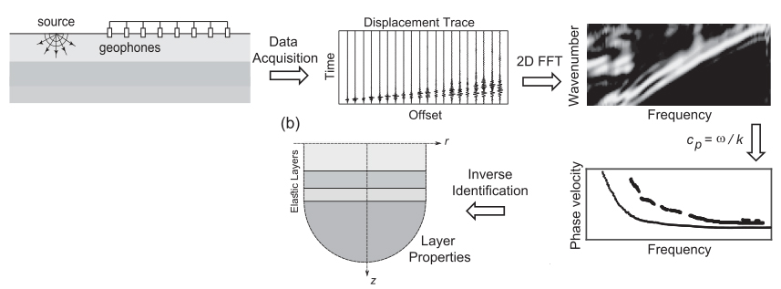
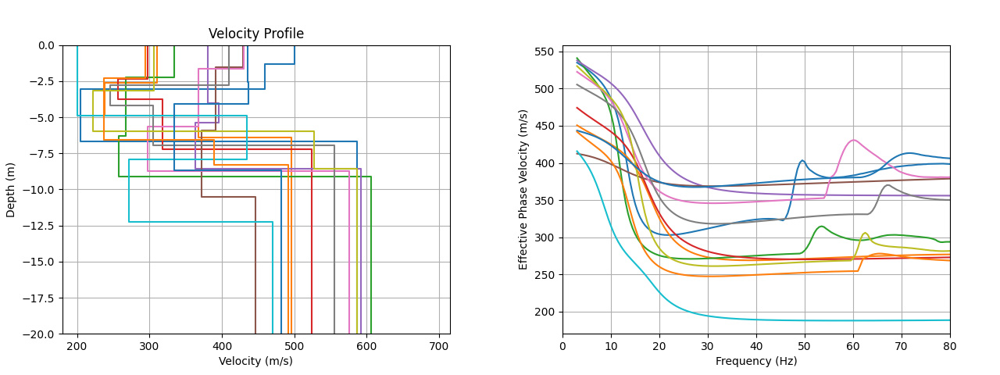
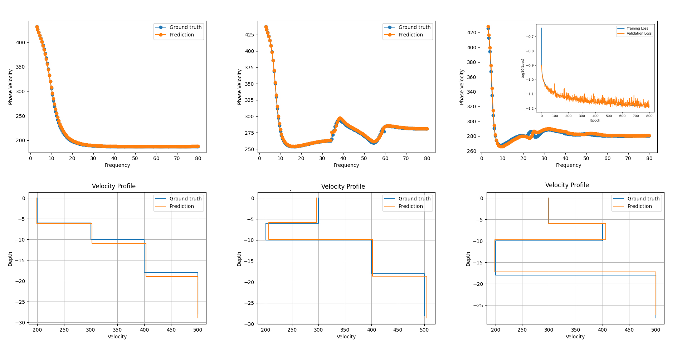
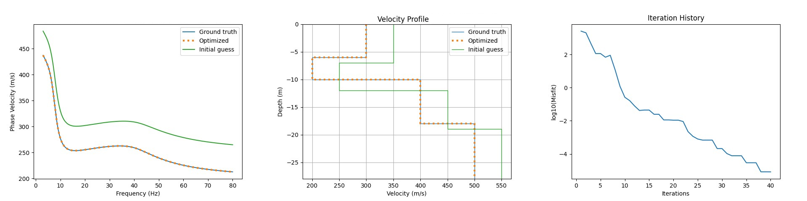
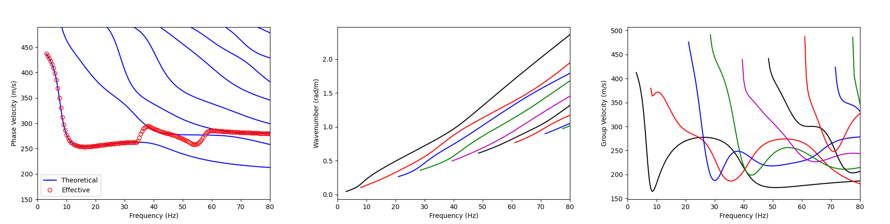

# WaveDisp

## Overview

WaveDisp is a Python package designed for wave dispersion analysis in layered media. For a detailed understanding of the
theory behind this package, please refer to the [presentation](image/theory.pdf). WaveDisp offers various
functionalities, including generating synthetic data, training neural networks, and predicting
wave dispersion properties based on input parameters.



## Features

- **Generate Synthetic Data:** Generate synthetic data for wave dispersion analysis with customizable parameters such as
  layer thickness, shear wave velocities, and frequency range.
- **Train Neural Networks:** Train neural network models to learn the relationship between input parameters and wave
  dispersion properties.
- **Predict Wave Dispersion:** Use trained models to predict wave dispersion properties based on input parameters,
  enabling fast and accurate analysis of layered media.
- **Classical Optimization:** Use classical optimization for inverting dispersion curves or use it in conjunction with
  neural network predictions.

## Generate Synthetic Data (multiprocessing/MPI)

The generation test generates synthetic data for wave dispersion analysis and saves it in the specified output
directory. To
run this test using multiprocessing on one machine:

```bash
python test/TestGeneration.py
```

For using MPI on multiple machines and multiprocessing on each, run this test:

```bash
mpiexec -n <num_ranks> python test/TestGeneration.py
```

Sample generated data is shown below:


## Train Neural Networks (CPU/GPU)

The training test trains the model and predicts the output for specific benchmarks, saving the prediction plots and
training history in the output directory. To specify whether to use CPU or GPU for training, relevant arguments can be
set in the test for CUDA visibility.

```bash
python test/TestTraining.py
```

By enabling the optimization feature in the test, classical optimization can be performed after obtaining network
predictions. To use MPI on multiple machines and perform many experiments simultaneously for hyperparameter tuning, use:

```bash
mpiexec -n <num_ranks> python test/TestTraining.py
```



## Classical Optimization

To use classical optimization (e.g., gradient-based methods), run this test:

```bash
python test/TestOptimization.py
```



## Dispersion Curves (theoretical/effective)

To solve the forward problem and obtain/plot the dispersion curves, run the test below:

```bash
python test/TestForward.py
```



## Contributors

- Ali Vaziri (@github-ava)

